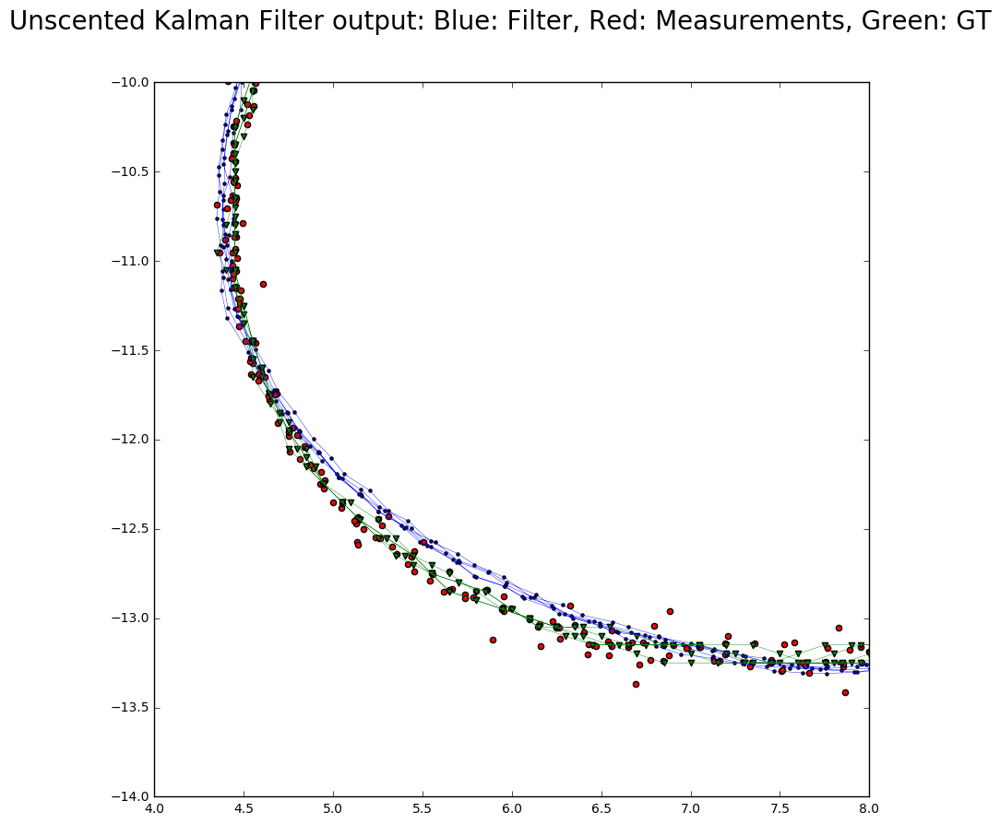
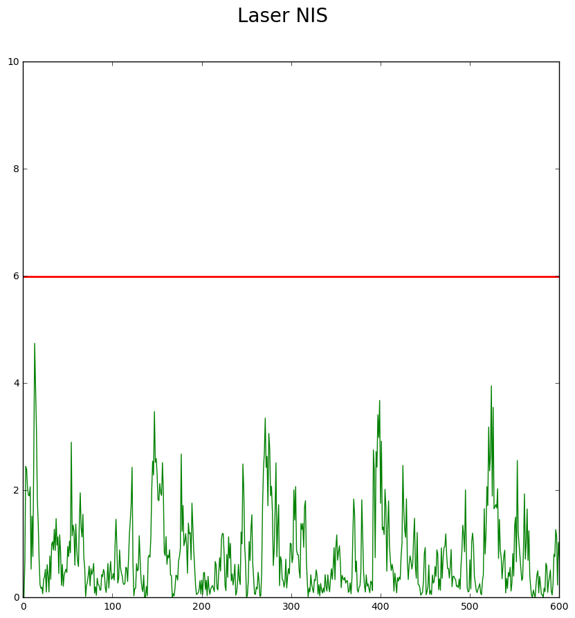
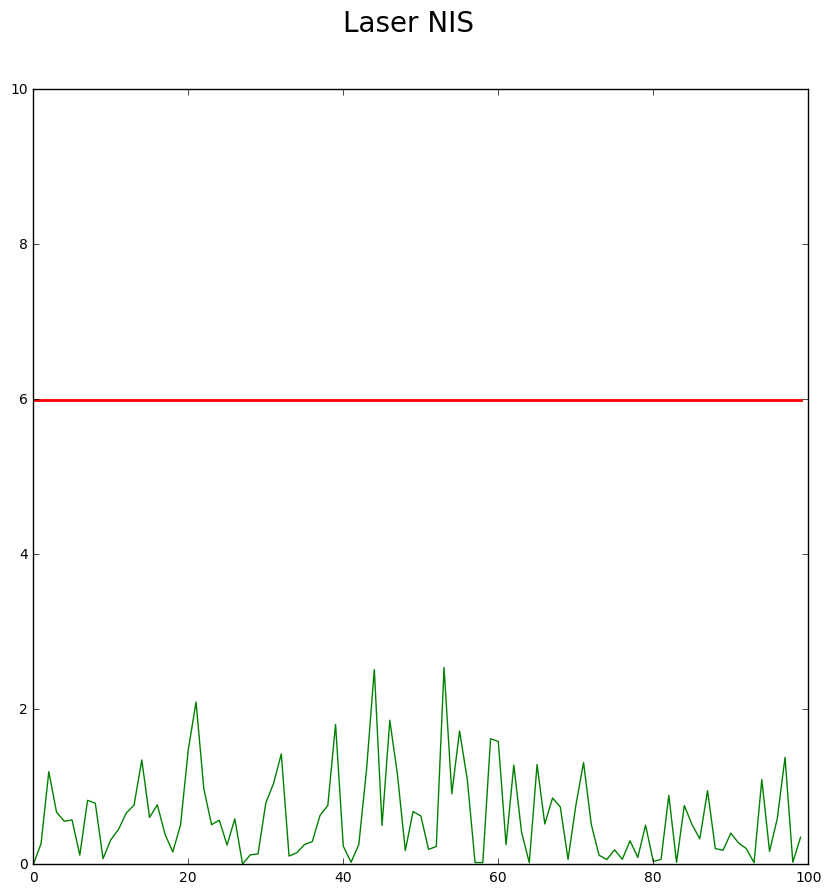

# Unscented Kalman Filter Project

Build the project from build directory
```
$cmake..&& make
```
Run the kalman Filter from the build directory
```
./UnscentedKF ../data/sample-laser-radar-measurement-data-1.txt ../results/data1_out.txt

```

## Dataset 1
Accuracy - RMSE:
- x: 0.794
- y: 0.884
- vx:  0.595
- vy:  0.593
- std_a_ = 1.5
- std_yawdd_ = 0.54

The following plots show the output for dataset 1. Interestingly, the velocity is tracked as negative. The RMSE would increase slightly if the velocity and yaw were flipped after prediction, perhaps the yaw rate also had to be managed.




The following plots show the NIS for the laser and radar data. It appears the process noise for the laser was estimated conservatively, while the noise the radar was estimated appropriately.




## Dataset 2
Accuracy - RMSE:
- x:  0.193
- y:  0.189
- vx:  0.500
- vy:   0.541
- std_a_ = 1.5
- std_yawdd_ = 0.54


The following plots show the NIS for the laser and radar data. It appears the process noise for the laser was estimated conservatively, while the noise the radar was estimated more appropriately.



